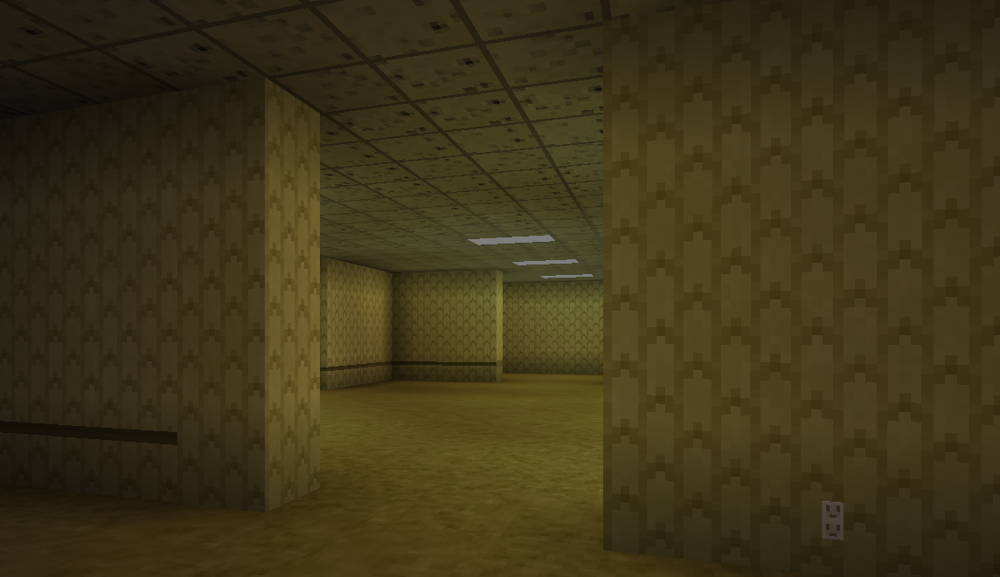

# Backrooms Mod

## Features so far
- 🟩 Backrooms blocks
  - 🟥 Fluorescent light buzz
- 🟩 Backrooms dimension
- 🆗 Custom world generation
  - 🟩 Room based world generation
  - 🟥 Non euclidean world generation (immersive portals)
  - 🟥 Multiple levels (as biomes)
- 🟥 Entities?
- 🟥 Entry portal and exit level
  - 🟥 Noclipping to enter
- 🟥 Spawn in the backrooms world generation option

## Setup

For setup instructions please see the [fabric wiki page](https://fabricmc.net/wiki/tutorial:setup) that relates to the IDE that you are using.

